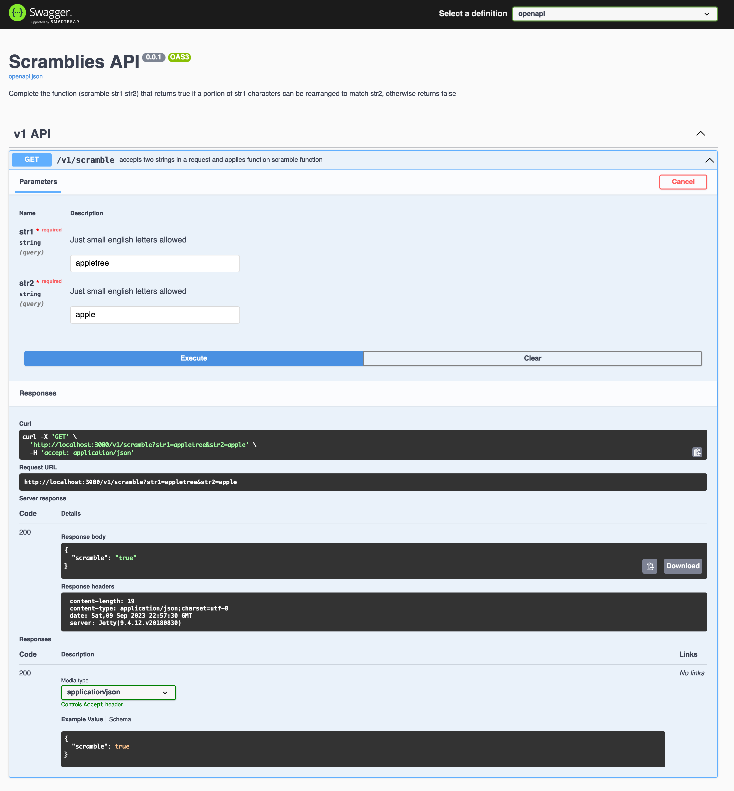
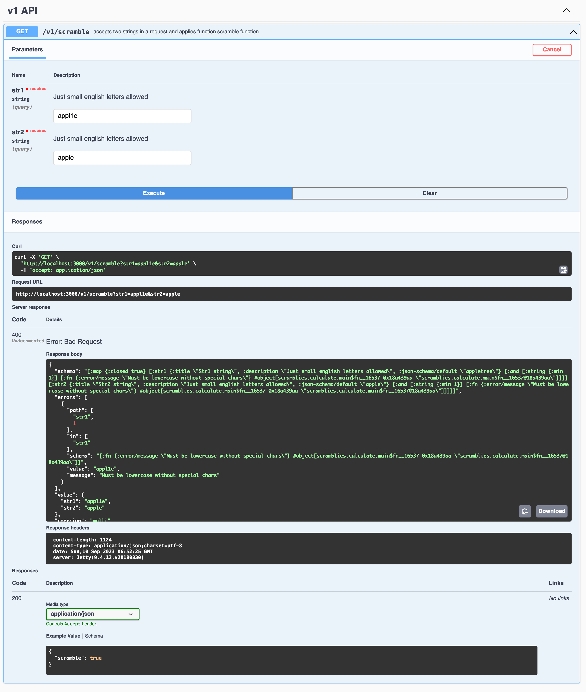

# Scramblies challenge

## Task 2

Create a web service that accepts two strings in a request and applies function scramble? from previous task to them.

## Launch the app

To launch the app with the dev alias, use the command clj `-A:dev -r` (or -M:dev). Alternatively, you can navigate to the user namespace and execute the `(go)` command. The app will launch on port 3000.

Stack: integrant + reitit + malli + swagger/openapi + kaocha 
(postgres just prepared, wasn't task)

Tests can be run with kaocha:
```bash
./kaocha --watch
```

### Screenshots

OpenAPI and Swagger UI.



Error handling with 'malli humanized' response:




