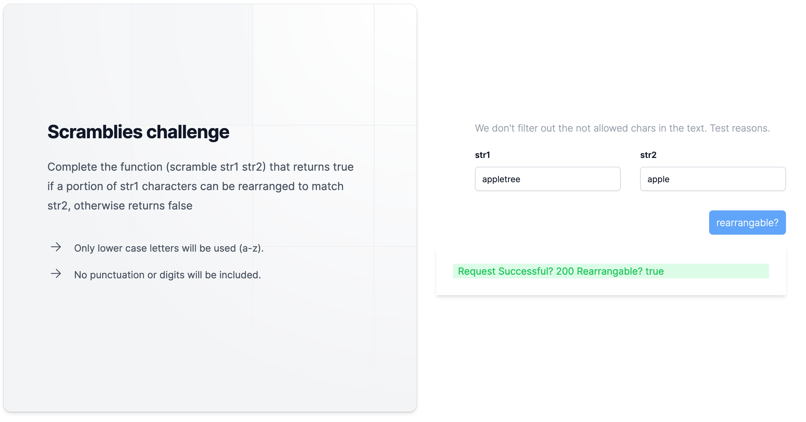
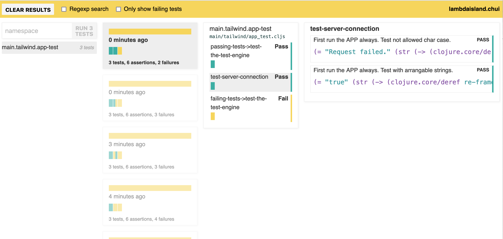

# Scramblies challenge

## Task 3

Create a UI in ClojureScript with two inputs for strings and a scramble button. When the button is fired it should call the API from previous task and display a result.

## Launch the app

Stack: Shadow-CLJS + Koacha-CLJS2 test engine + Reagent/ Re-Frame + TailwindCSS

First run the backend engine!

To launch the app first please add the nodejs dependencies: `yarn` or `npm install`.
After this you can call from terminal: `npx shadow-cljs watch app`, you can connect trought nREPL (trought port of nREPL file).
Open a new terminal and run `npm run postcss:watch` command to watch the Tailwind css changes.

If your run these commands, you can open the 
`http://localhost:8020/` > Frontend UI 
`http://localhost:8000/` > Test UI
`http://localhost:9630/` > Shadow-CLJS Server UI (if you want to `tap>` something)
in your browser.

The tests running automatically, don't disturb you the red line at bottom (that is different instance).
I don't use validators now at the Frontend, because in this case we can't do a lot. Of course I can filter out all special chars etc.

The Frontend UI is connect to localhost:3000, so you can test the API with the UI.
Error responses are limited depth now.

### Screenshots

Frontend UI

Test UI

