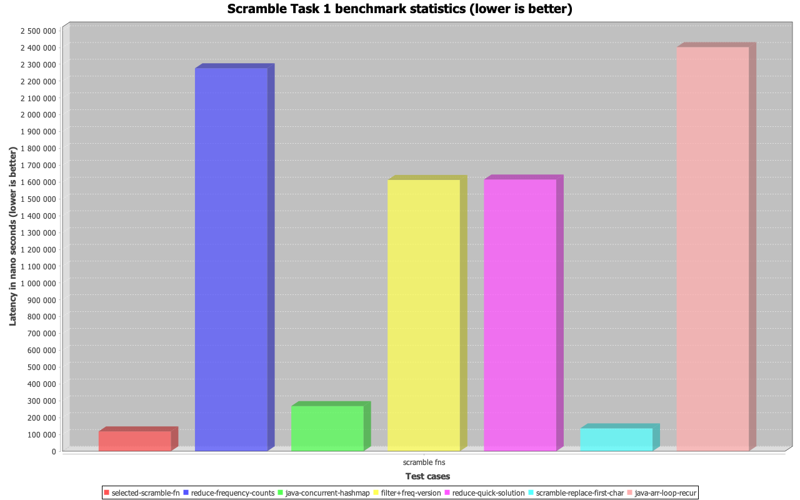

# Scramblies challenge

## Task

Complete the function (main.scramble str1 str2) that returns true if a portion of str1 characters can be rearranged to match str2, otherwise returns false

Notes:

● Only lower case letters will be used (a-z). No punctuation or digits will be included.

● Performance needs to be considered

Examples:

1. (main.scramble? “rekqodlw” ”world”) ==> true

2. (main.scramble? “cedewaraaossoqqyt” ”codewars”) ==> true

3. (main.scramble? “katas” “steak”) ==> false

## Performance benchmark

To ensure the efficiency of the main.scramble function, I conducted a series of benchmarks using the Criterium library. 

| Playground   | Type                            | Execution time mean | Readability |
|----------|---------------------------------|---------------------|--|
| selected-main.scramble-fn | built-in clojure.string fn      | 118,088618 µs            | perfect |
| reduce-frequency-count | reduce focus                    | 2,276404 ms            |  |
| java-concurrent-hashmap | java concurrent                 | 268,621450 µs           | bad |
| filter+freq-version | reduce+                         |  1,612680 ms          |  |
| reduce-quick-solution | post process with custom reduce | 1,615358 ms           |  |
| main.scramble-replace-first-char | replace first char2             | 136,288913 µs            |  |
| java-arr-loop-recur | not optimized (bad)             |  2,402513 ms            |  |

### Chart of Benchmark result



Benchmarks executed with these params on 2,7 GHz Intel Core i7, 16 GB Macbook.
```clojure
(def s1 (generate-random-string 10000))
(def s2 (generate-random-string 100))
```

## Tests

To run tests, execute the following command:

```bash
./kaocha --watch
```
or run with clojure cli tools once:
```bash
clojure -M:test
```

###  The performance of the core scramble function

Runned the tests with sizes: str1 10k, str2 100.

```clojure
Evaluation count : 274680 in 60 samples of 4578 calls.
             Execution time mean : 221,717741 µs
    Execution time std-deviation : 5,246485 µs
   Execution time lower quantile : 218,230747 µs ( 2,5%)
   Execution time upper quantile : 236,056826 µs (97,5%)
                   Overhead used : 3,493666 ns

Found 4 outliers in 60 samples (6,6667 %)
	low-severe	 1 (1,6667 %)
	low-mild	 3 (5,0000 %)
 Variance from outliers : 11,0336 % Variance is moderately inflated by outliers
```

